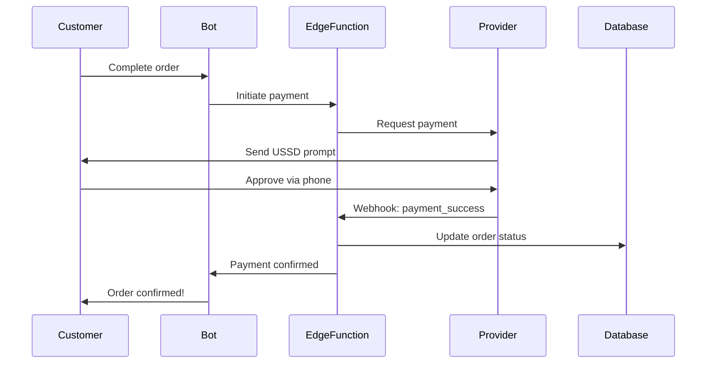

# Payment Integration Architecture

## Overview

This document outlines the payment integration architecture for the Fashion Retail Platform, supporting mobile money payments in Cameroon through MTN Mobile Money and Orange Money.

## Current Status: MVP with Stubs ✅

**Environment:** Development/Testing  
**API Keys:** Set to `"test"` for both providers  
**Behavior:** Stub implementations that simulate payment processing

### Stub Behavior

- **Auto-approve**: Payments ≤ 10,000 XAF are automatically marked as "success"
- **Pending**: Payments > 10,000 XAF are marked as "pending" (requires manual confirmation)
- **Transaction IDs**: Generated with format `MTN-{timestamp}-{random}` or `ORA-{timestamp}-{random}`
- **Delay Simulation**: 1-1.2 second artificial delay to simulate API calls

## Architecture Components

```
┌─────────────────────────────────────────────────────────────┐
│                     Mobile App (React Native)                │
│  - Order creation with payment method selection             │
│  - Payment status display                                   │
│  - Manual payment instructions (for MVP)                    │
└──────────────────────┬──────────────────────────────────────┘
                       │
                       │ REST API calls
                       │
┌──────────────────────▼──────────────────────────────────────┐
│            Supabase Edge Functions                          │
│  ┌────────────────────────────────────────────────────┐    │
│  │  process-payment/index.ts                          │    │
│  │  - Initiate payment                                │    │
│  │  - Verify payment status                           │    │
│  │  - Update order payment status                     │    │
│  └────────────────────┬───────────────────────────────┘    │
│                       │                                      │
│  ┌────────────────────▼───────────────────────────────┐    │
│  │  _shared/payment-providers.ts                      │    │
│  │  - processMTNPayment()                             │    │
│  │  - processOrangePayment()                          │    │
│  │  - verifyPaymentStatus()                           │    │
│  │  - handlePaymentWebhook()                          │    │
│  └────────────────────┬───────────────────────────────┘    │
└───────────────────────┼──────────────────────────────────────┘
                        │
        ┌───────────────┴───────────────┐
        │                               │
        ▼                               ▼
┌──────────────────┐          ┌──────────────────┐
│   MTN MoMo API   │          │ Orange Money API │
│   (Stub for MVP) │          │  (Stub for MVP)  │
└──────────────────┘          └──────────────────┘
```

## Payment Flow

### 1. Order Creation (WhatsApp)

```
Customer → WhatsApp → Bot → Order Handler
                              │
                              ├─ Create order (status: pending)
                              ├─ Payment method selection
                              └─ Send payment instructions
```

### 2. Payment Initiation (Manual MVP)

```
Retailer Dashboard → View order → Confirm payment received
                                   │
                                   └─ Update order.payment_status = 'paid'
```

### 3. Payment Processing (Future Automated)



## Payment Methods

### MTN Mobile Money (MTN MoMo)

**Coverage:** ~60% of mobile money users in Cameroon

**Advantages:**
- Largest user base
- Well-documented API
- Reliable infrastructure

**MVP Implementation:**
```typescript
// Stub automatically approves small payments
if (amount <= 10000) {
  status = 'success'
} else {
  status = 'pending' // Manual confirmation needed
}
```

**Production Integration:**
1. Register at [MTN MoMo Developer Portal](https://momodeveloper.mtn.com/)
2. Get credentials:
   - User ID
   - API Key
   - Subscription Key (Primary/Secondary)
3. Implement OAuth 2.0 token generation
4. Use Collection API for payments
5. Set up webhook for status updates

**API Endpoints:**
- Sandbox: `https://sandbox.momodeveloper.mtn.com/`
- Production: `https://momoapi.mtn.com/`

**Key APIs:**
- `POST /collection/v1_0/requesttopay` - Initiate payment
- `GET /collection/v1_0/requesttopay/{referenceId}` - Check status

### Orange Money

**Coverage:** ~35% of mobile money users in Cameroon

**Advantages:**
- Second largest provider
- Good coverage in francophone regions
- Bank integration

**MVP Implementation:**
```typescript
// Same stub behavior as MTN
if (amount <= 10000) {
  status = 'success'
} else {
  status = 'pending'
}
```

**Production Integration:**
1. Register at [Orange Developer Portal](https://developer.orange.com/)
2. Subscribe to Orange Money API
3. Get merchant credentials:
   - Merchant Code
   - API Key
   - Secret Key
4. Implement OAuth 2.0 token generation
5. Use Web Payment API
6. Set up callback URL for notifications

**API Endpoints:**
- Production: `https://api.orange.com/orange-money-webpay/`

**Key APIs:**
- `POST /webpayment` - Initiate payment
- `GET /webpayment/{id}` - Check status

## Database Schema

### Orders Table (Payment Fields)

```sql
-- Payment tracking
payment_status payment_status NOT NULL DEFAULT 'pending',
payment_method TEXT,  -- 'MTN Mobile Money' or 'Orange Money'

-- Metadata stores payment details
metadata JSONB DEFAULT '{}'::jsonb
-- {
--   "payment_transaction_id": "MTN-1234567890-abc123",
--   "payment_provider": "MTN Mobile Money",
--   "payment_initiated_at": "2024-01-15T10:30:00Z",
--   "payment_confirmed_at": "2024-01-15T10:31:15Z"
-- }
```

### Payment Status Enum

```sql
CREATE TYPE payment_status AS ENUM (
  'pending',   -- Awaiting payment
  'partial',   -- Partially paid (for split payments)
  'paid',      -- Fully paid
  'refunded'   -- Payment refunded
);
```

## Edge Function API

### Endpoint: `/process-payment`

**Initiate Payment:**
```http
POST /process-payment
Authorization: Bearer <user-token>
Content-Type: application/json

{
  "action": "initiate",
  "provider": "mtn",
  "amount": 5000,
  "currency": "XAF",
  "customerPhone": "+237670000000",
  "orderId": "ORD-20240115-001"
}
```

**Response:**
```json
{
  "success": true,
  "transactionId": "MTN-1705315800000-xyz789",
  "status": "success",
  "message": "Payment completed successfully",
  "provider": "MTN Mobile Money",
  "metadata": {
    "stub": true,
    "customerPhone": "+237670000000",
    "amount": 5000,
    "timestamp": "2024-01-15T10:30:00.000Z"
  }
}
```

**Verify Payment:**
```http
POST /process-payment
Authorization: Bearer <user-token>
Content-Type: application/json

{
  "action": "verify",
  "provider": "mtn",
  "transactionId": "MTN-1705315800000-xyz789"
}
```

## Environment Variables

### Current (MVP)

```bash
# MVP stub keys
MTN_MOMO_API_KEY=test
ORANGE_MONEY_API_KEY=test
```

### Production (Future)

```bash
# MTN Mobile Money
MTN_MOMO_USER_ID=your_user_id
MTN_MOMO_API_KEY=your_api_key
MTN_MOMO_SUBSCRIPTION_KEY=your_subscription_key
MTN_MOMO_ENVIRONMENT=production  # or 'sandbox'

# Orange Money
ORANGE_MONEY_MERCHANT_CODE=your_merchant_code
ORANGE_MONEY_API_KEY=your_api_key
ORANGE_MONEY_SECRET_KEY=your_secret_key
ORANGE_MONEY_ENVIRONMENT=production  # or 'sandbox'

# Webhook Configuration
PAYMENT_WEBHOOK_URL=https://your-domain.com/functions/payment-webhook
PAYMENT_WEBHOOK_SECRET=your_webhook_secret
```

## Migration Path: MVP → Production

### Phase 1: MVP (Current) ✅
- [x] Stub payment providers
- [x] Manual payment confirmation via dashboard
- [x] Order payment status tracking
- [x] Payment instructions via WhatsApp
- [x] Basic transaction logging

### Phase 2: Sandbox Testing
- [ ] Register with MTN and Orange developer portals
- [ ] Obtain sandbox credentials
- [ ] Replace stubs with sandbox API calls
- [ ] Test full payment flow in sandbox
- [ ] Implement webhook handlers
- [ ] Test error scenarios

### Phase 3: Production Integration
- [ ] Get production credentials
- [ ] Implement OAuth 2.0 token management
- [ ] Add retry logic and error handling
- [ ] Set up payment webhook endpoints
- [ ] Implement transaction reconciliation
- [ ] Add payment analytics
- [ ] Security audit

### Phase 4: Advanced Features
- [ ] Split payments (multiple providers)
- [ ] Payment links (for web checkout)
- [ ] Recurring payments (subscriptions)
- [ ] Refund handling
- [ ] Dispute resolution
- [ ] Payment reminders

## Security Considerations

### Current (MVP)
- ✅ Edge Functions require authentication
- ✅ Row Level Security on orders table
- ✅ Stub keys don't expose real credentials
- ✅ Payment status stored in database

### Production Requirements
- [ ] Webhook signature verification
- [ ] API key rotation strategy
- [ ] Rate limiting on payment endpoints
- [ ] PCI DSS compliance review
- [ ] Transaction logging for audits
- [ ] Fraud detection rules
- [ ] Customer phone number validation
- [ ] Amount validation and limits

## Testing

### Manual Testing (Current MVP)

1. **Create Order via WhatsApp**
   ```
   Customer: "I want to buy Product X"
   Bot: "Your order ORD-123 total: 5000 XAF"
   Bot: "Payment instructions:
         MTN: *126# or transfer to [number]
         Orange: #144# or transfer to [number]"
   ```

2. **Verify in Dashboard**
   - Open mobile app → Orders tab
   - See order with status "Pending"
   - Payment status: "pending"

3. **Simulate Payment**
   - Currently manual: retailer marks as paid
   - Future: API call to process-payment function

### Automated Testing (Future)

```typescript
// Unit test example
Deno.test('MTN stub approves small payments', async () => {
  const result = await processMTNPayment({
    amount: 5000,
    currency: 'XAF',
    customerPhone: '+237670000000',
    orderId: 'TEST-001',
  });
  
  assertEquals(result.status, 'success');
  assertEquals(result.provider, 'MTN Mobile Money');
});
```

## Monitoring & Analytics

### Metrics to Track

**Payment Success Rate:**
```sql
SELECT 
  payment_method,
  COUNT(*) as total_attempts,
  SUM(CASE WHEN payment_status = 'paid' THEN 1 ELSE 0 END) as successful,
  ROUND(100.0 * SUM(CASE WHEN payment_status = 'paid' THEN 1 ELSE 0 END) / COUNT(*), 2) as success_rate_percent
FROM orders
WHERE payment_method IS NOT NULL
GROUP BY payment_method;
```

**Average Payment Time:**
```sql
SELECT 
  payment_method,
  AVG(
    EXTRACT(EPOCH FROM 
      (metadata->>'payment_confirmed_at')::timestamp - 
      (metadata->>'payment_initiated_at')::timestamp
    )
  ) / 60 as avg_minutes
FROM orders
WHERE payment_status = 'paid'
GROUP BY payment_method;
```

## Support & Troubleshooting

### Common Issues (MVP)

**Issue:** Order shows "pending" forever  
**Solution:** Manually update in dashboard or database

**Issue:** Customer didn't receive payment instructions  
**Solution:** Check WhatsApp webhook is working, resend instructions

**Issue:** Payment marked as paid but not reflected  
**Solution:** Check database update, verify RLS policies

### Production Troubleshooting

- **Payment Timeout:** Check provider status page
- **Webhook Not Received:** Verify URL, check logs
- **Transaction Mismatch:** Use reconciliation API
- **Customer Balance Issue:** Contact provider support

## Resources

### Official Documentation

- [MTN MoMo API Docs](https://momodeveloper.mtn.com/api-documentation/)
- [Orange Money API Docs](https://developer.orange.com/apis/orange-money/)
- [Supabase Edge Functions](https://supabase.com/docs/guides/functions)

### Community & Support

- MTN MoMo Developer Community
- Orange Developer Forum
- Supabase Discord

### Code Examples

- GitHub: [mtn-momo-node](https://github.com/gsmainclusivetechlab/mtn-momo-nodejs)
- GitHub: [orange-money-samples](https://github.com/Orange-OpenSource/Orange-Money-API-samples)

## Next Steps

1. ✅ **Complete MVP** (Current task)
   - Stub implementations working
   - Manual payment confirmation
   - Basic order tracking

2. **Sandbox Integration** (Estimated: 2-3 weeks)
   - Register accounts
   - Implement API calls
   - Test thoroughly

3. **Production Deployment** (Estimated: 1-2 weeks)
   - Get production credentials
   - Security audit
   - Go live

4. **Monitoring & Optimization** (Ongoing)
   - Track metrics
   - Optimize success rate
   - Add features based on usage

---

**Document Version:** 1.0  
**Last Updated:** January 2024  
**Status:** MVP Complete with Stubs ✅
